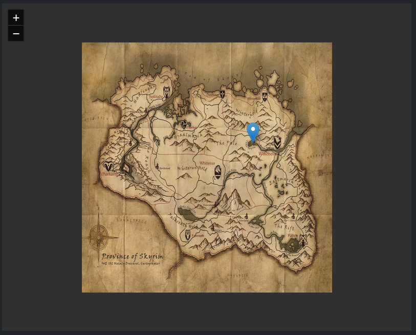

# &lt;geocreator-map&gt;
A web component that displays an interactive map.

## Properties
`markerPosition` (readonly) - An object that contains the x and y coordinates of the marker on the map.

## Attributes
`src` - A string representing the URL of the map source.

`allowplacingmarker` - A boolean that determines if the user can place markers on the map. Default is `false`.

## Methods
`placeMarkerLink(x: number, y: number, callback?: Function)` - A method that places a marker on the map and calls an optional callback function when the marker is clicked.

`clear()` - A method that clears all markers from the map.

## Events
`markerplaced` - An event that is triggered when a marker is placed on the map. The event detail contains the x and y coordinates of the marker.

## Example

```html
<geocreator-map src="./img/image.png"></geocreator-map>
```

